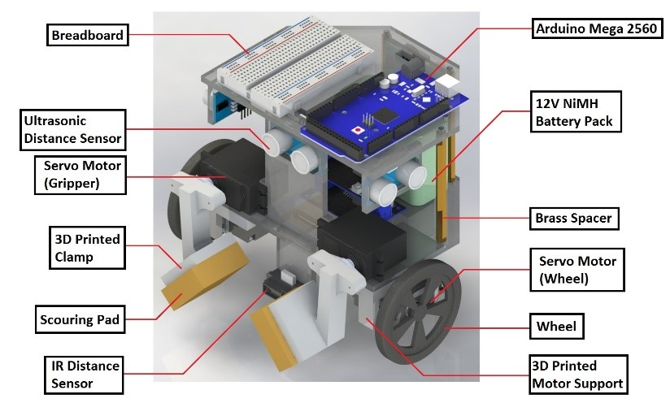
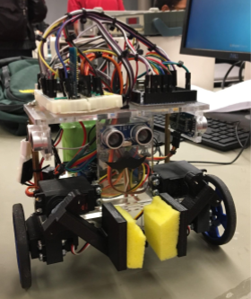

# Autonomous-Maze-Solving-Rover

video of project:
https://www.youtube.com/watch?v=UskGFBRVmHA

"Mechatronics Systems: Design &amp; Integration" Project, designed and built an autonomous rover using Arduino as the platform. The rover was able to accomplish the following three tasks during the 5 minutes demo: Firstly, It can localize itself after being placed in a random starting location in the maze. Secondly, The rover can detect and avoid obstacles while maneuvering through the maze. And lastly, the rover can search and pick up a block in the loading zone and deliver the block to the designated drop-off zone. Accomplished an additional task of using Bluetooth module to have the rover communicate with Matlab to achieve real-time inter-program communication and displaying the current location of the rover. 

Rover uses IMU6050 gyroscope

Main arduino program in folder "rover_arduino_code"

matlab code in folder "matlab_code"
